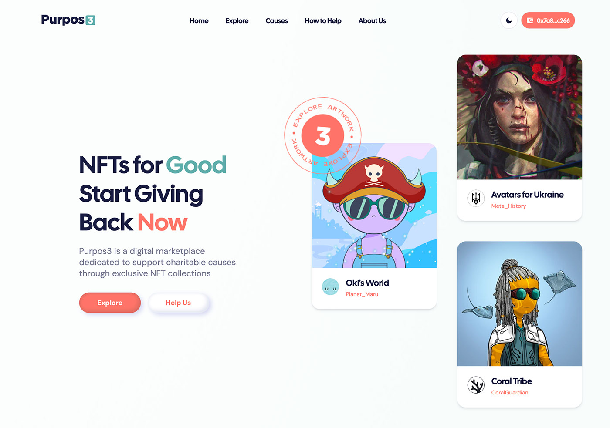

# Purpos3 - NFT Marketplace for Charity

**_NFTs for Good_**

Purpos3 is an NFT Marketplace used to support charities, NGOs and community projects.
It is deployed on the Polygon Blockchain and helps organizations set up and launch special NFT collections, with the majority of the sale value going directly to the project that created it.

The Front-end and Smart Contracts have been developed by the AXP3 Studio.

## The Stack

This is a full stack application using:

- **CSS framework** - [Tailwind](https://tailwindcss.com/)
- **Solidity development environment** - [Hardhat](https://hardhat.org/)
- **Ethereum Web Client Library** - [Ethers.js](https://docs.ethers.io/v5/)

## Smart Contracts

The project logic consists of two smart contracts:

- **NFT.sol** - This contract allows organizations to mint unique NFTs as ERC-721 tokens for their project.
- **Market.sol** - The contracts handles all marketplace interactions: listing of NFTs for sale, transfer of tokens between users after sale, royalties...

The contract for the marketplace has been deployed and verified on the Polygon Mumbai network, and is accessible [here](https://mumbai.polygonscan.com/address/0x1D05e0E0AF984F24422E915c7B017312d1b229C3).

## Next Steps

This project is still in Beta phase.

Future developments include implementing the missing pages as well as handling wallet connections to the DAPP (linked to a user profile on the marketplace).

## Screenshots

Screenshots of the marketplace : [[1]](screenshots/screenshot_purpos3_home.png) - [[2]](screenshots/screenshot_purpos3_nft.png) - [[3]](screenshots/screenshot_purpos3_causes.png) - [[4]](screenshots/screenshot_purpos3_user.png)
